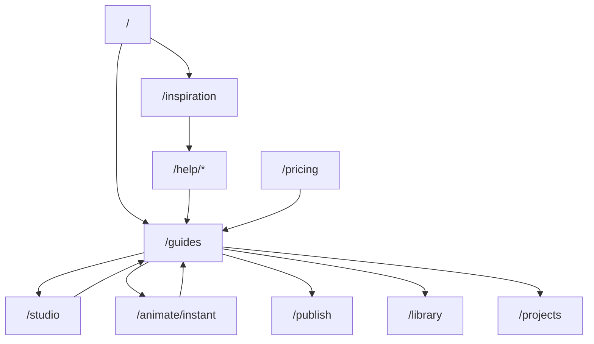

# Creator Dream SEO Roadmap

**Product:** HomeCheff Studio  
**Date:** June 2026  
**Status:** Planning — inspirational positioning only

This roadmap targets **aspirational creator intent**: people who want to become their own filmmaker, director, or animation studio — without claiming to be Pixar, Disney, DreamWorks, or any trademark holder.

---

## Legal & brand guardrails

| Rule | Implementation |
|------|----------------|
| **No brand confusion** | Never use “Pixar”, “Disney”, or “DreamWorks” in titles, URLs, or meta as if HomeCheff is them |
| **Inspirational only** | Phrases like “studio-style storytelling workflow” or “animated-film-inspired pipeline” |
| **No misleading claims** | Do not promise theatrical quality, box-office distribution, or official style cloning |
| **Disclaimer on inspiration pages** | *HomeCheff Studio is not affiliated with [Studio]. References describe workflow inspiration only.* |
| **Trademark** | Use ™ only when legally required; prefer generic “major animation studio workflow” in body copy |

**Approved framing:** *“Build your own animated series with an AI-assisted, story-first production line — inspired by how professional studios plan before they animate.”*

---

## HomeCheff narrative pillars (every page)

1. **Story-first creation** — storyboards and scenes before clips  
2. **AI-assisted production** — generation where it saves time; human creative control where it matters  
3. **Reusable characters** — identity profiles in Library  
4. **Reusable worlds** — worlds, locations, props  
5. **Reusable voices** — character voice assignment + library  
6. **Automatic subtitles** — generate, style, safe zones  
7. **Automatic translation** — multi-language versions  
8. **Automatic publishing** — version exports for channels  
9. **Automatic video assembly** — Motion segment merge + final assembly  
10. **AI director workflow** — Studio director mode, scene planning, production brief  

---

## Keyword clusters — aspirational creator intent

### Cluster A: Filmmaker / director identity

| Keyword / phrase | Search intent | Recommended surface | Priority |
|------------------|---------------|---------------------|----------|
| become your own filmmaker | Aspirational + commercial | `/guides/become-your-own-filmmaker` | P0 |
| become your own director | Aspirational + commercial | `/guides/become-your-own-director` | P0 |
| filmmaker workflow | Informational | `/inspiration/filmmaker-workflow` | P1 |
| director workflow | Informational | `/inspiration/director-workflow` | P1 |
| indie filmmaker tools | Commercial | `/guides/indie-filmmaker-ai-studio` | P1 |
| solo filmmaker software | Commercial | `/` + guide | P1 |

**Search intent:** User imagines a career or identity shift — wants a **path**, not just a tool. Content must be educational (acts, beats, scenes) then introduce HomeCheff as the production system.

**HomeCheff angle:** You direct the story; AI handles asset generation, voice, assembly, and versions.

**Internal links:** `/studio`, `/studio/storyboards/new`, `/help/getting-started-with-studio`, `/library`, `/projects`

---

### Cluster B: Make your own movie / film

| Keyword / phrase | Search intent | Recommended surface | Priority |
|------------------|---------------|---------------------|----------|
| make your own movie | High-volume aspirational | `/guides/make-your-own-movie-with-ai` | P0 |
| make your own short film | Aspirational | `/guides/make-your-own-short-film` | P0 |
| make a movie without a crew | Problem-aware | `/help/create-video-without-editing-experience` | P0 |
| AI film studio | Commercial | `/guides/ai-film-studio` | P0 |
| digital production studio | Commercial | `/guides/digital-production-studio` | P1 |
| online film production | Commercial | `/` production line | P1 |

**HomeCheff angle:** Storyboard → scene images → Motion → voice/subtitles → Publish. One project tracks the “film.”

**Internal links:** `/studio`, `/animate/instant`, `/publish`, `/projects`, `/pricing`

---

### Cluster C: Animation & cartoon creation

| Keyword / phrase | Search intent | Recommended surface | Priority |
|------------------|---------------|---------------------|----------|
| make your own animation | Aspirational | `/guides/make-your-own-animation` | P0 |
| create your own cartoon | Aspirational (esp. parents/creators) | `/guides/create-your-own-cartoon` | P0 |
| create your own manga | Aspirational (visual style) | `/guides/create-your-own-manga-style-series` | P2 |
| create your own animated series | Series intent | `/guides/create-your-own-animated-series` | P0 |
| AI animation studio | Commercial | `/guides/ai-animation-studio` | P0 |
| cartoon series workflow | Informational | `/inspiration/animated-series-workflow` | P1 |

**HomeCheff angle:** Reusable characters + episodic projects + Library consistency = series production, not one-off clips.

**Internal links:** `/studio/characters`, `/library`, `/projects`, `/help/character-identity-basics` (planned)

**Guardrail:** “Manga” content = **style and panel-to-scene workflow inspiration** — not claiming to replicate specific IP or styles.

---

### Cluster D: Professional studio workflow (inspirational)

| Keyword / phrase | Search intent | Recommended surface | Priority |
|------------------|---------------|---------------------|----------|
| pixar style storytelling workflow | Informational (inspirational) | `/inspiration/animation-studio-storytelling-workflow` | P2 |
| disney style creative workflow | Informational (inspirational) | Same hub — one page, generic sections | P2 |
| dreamworks style creative workflow | Informational (inspirational) | Same hub | P2 |
| how animation studios plan films | Informational | `/inspiration/how-animation-studios-plan-production` | P1 |
| storyboard to final animation pipeline | Informational | `/inspiration/storyboard-to-animation-pipeline` | P0 |

**URL naming:** Avoid `pixar`, `disney`, `dreamworks` in slugs. Use generic `/inspiration/animation-studio-*` URLs.

**Content structure (inspiration page):**

1. How major studios **plan** (story, acts, scenes) — generic industry knowledge  
2. What solo creators can **reuse** (storyboard discipline, character bible, versioning)  
3. Where AI **accelerates** (scene images, motion, voice, subtitles)  
4. How HomeCheff maps to that pipeline (Editor, Studio, Motion, Publish)  
5. Disclaimer + CTA  

**Internal links:** `/studio`, `/help/create-a-storyboard` (planned), `/guides/create-your-own-animated-series`

---

## Content types — full roadmap

### 1. Landing pages (`/guides/*`)

High-intent aspirational landers. Minimum 1,200 words + workflow diagram + FAQ.

| Slug | Title (SEO) | Wave |
|------|-------------|------|
| `become-your-own-filmmaker` | Become Your Own Filmmaker with AI — HomeCheff Studio | W1 |
| `become-your-own-director` | Become Your Own Director — Story-First AI Production | W1 |
| `make-your-own-movie-with-ai` | Make Your Own Movie with AI — From Storyboard to Screen | W1 |
| `make-your-own-short-film` | Make Your Own Short Film Online | W1 |
| `make-your-own-animation` | Make Your Own Animation — No Experience Required | W1 |
| `create-your-own-cartoon` | Create Your Own Cartoon with AI Characters | W1 |
| `create-your-own-animated-series` | Create Your Own Animated Series — Episodic Workflow | W2 |
| `ai-film-studio` | AI Film Studio for Independent Creators | W2 |
| `ai-animation-studio` | AI Animation Studio — Characters, Worlds, Motion | W2 |
| `digital-production-studio` | Digital Production Studio in Your Browser | W2 |
| `indie-filmmaker-ai-studio` | Indie Filmmaker Tools — All-in-One AI Suite | W3 |
| `create-your-own-manga-style-series` | Create a Manga-Inspired Animated Series | W3 |

**Interim surfaces (live today):** `/`, `/studio`, `/animate/instant` — add “Creator guides” footer block when first guide ships.

---

### 2. Help center articles (`/help/*`)

Educational, task-oriented — support guides and capture long-tail search.

| Slug | Title | Links to guide |
|------|-------|----------------|
| `story-first-production-explained` | What is story-first video production? | `/guides/become-your-own-director` |
| `plan-your-first-ai-film` | Plan your first AI film in 7 steps | `/guides/make-your-own-movie-with-ai` |
| `character-bible-for-series` | Build a character bible for recurring series | `/guides/create-your-own-animated-series` |
| `world-building-for-animation` | Worlds, locations and props for consistency | `/library` |
| `ai-director-mode-overview` | AI director workflow in Studio | `/studio` |
| `from-storyboard-to-final-video` | From storyboard to final video assembly | `/inspiration/storyboard-to-animation-pipeline` |
| `episodic-project-setup` | Set up an episodic project | `/projects` |
| `voice-your-characters` | Assign reusable voices to characters | Voice help cluster |
| `subtitle-and-translate-your-series` | Subtitles and translation for series | Translation cluster |
| `publish-episodes-and-versions` | Publish episodes and versions | `/publish` |

---

### 3. Comparison pages

Creator-dream comparisons are **not** competitor alts — they compare **old workflow vs AI-assisted workflow**.

| Slug | Title | Intent |
|------|-------|--------|
| `/guides/vs-hiring-a-video-team` | AI production line vs hiring a small crew | Cost / solo creator |
| `/guides/vs-traditional-animation-pipeline` | Modern AI-assisted vs traditional animation pipeline | Education |
| `/guides/vs-one-off-ai-clips` | Series production vs one-off AI clip tools | vs Pika/Runway-style |

Cross-link to `docs/SEO_COMPARISON_ALTERNATIVE_ROADMAP.md` for tool-specific alts.

---

### 4. Inspiration pages (`/inspiration/*`)

Low commercial pressure, high topical authority. Generic studio references only.

| Slug | Title | Notes |
|------|-------|-------|
| `animation-studio-storytelling-workflow` | Animation studio storytelling workflow (inspiration) | Mentions “studios like those behind major animated films” — no logos |
| `how-animation-studios-plan-production` | How animation studios plan production | Acts, storyboards, dailies metaphor |
| `storyboard-to-animation-pipeline` | Storyboard to animation pipeline | Maps to HomeCheff modules |
| `filmmaker-workflow` | Filmmaker workflow for solo creators | Pre-production → post |
| `director-workflow` | Director workflow — creative control with AI assist | Director decisions vs AI execution |
| `animated-series-workflow` | Animated series workflow for independents | Episodic Library + Projects |

**Schema:** `Article` + `BreadcrumbList`; no `SoftwareApplication` on inspiration pages (avoid over-claiming).

---

### 5. Creator guides hub

| URL | Purpose |
|-----|---------|
| `/guides` | Index all creator guides by goal: Film / Animation / Series / Director |
| `/inspiration` | Index inspiration articles |
| `/help` | “Creator academy” category linking guides + help |

**Homepage addition (future):** “Start your production” → `/guides` with three cards: *Make a film*, *Make a cartoon*, *Run a series*.

---

## Internal linking architecture



### Anchor text examples (descriptive)

- “story-first filmmaker guide” → `/guides/become-your-own-filmmaker`  
- “animated series workflow” → `/guides/create-your-own-animated-series`  
- “how studios plan before animating” → `/inspiration/how-animation-studios-plan-production`  

---

## Differentiation summary (vs generic AI video tools)

| Creator dream | Generic AI clip tool | HomeCheff Studio |
|---------------|----------------------|------------------|
| “I want to be a filmmaker” | Single prompt → one clip | Storyboard → scenes → assembly → publish |
| “I want a cartoon series” | Inconsistent characters | Character bible + Library |
| “I want to direct” | No planning tools | AI director + production brief |
| “I want global audience” | Manual re-edit per language | Subtitles + translation versions |
| “I want a portfolio of work” | Downloads scattered | Projects + version lineage |

---

## Publishing waves

| Wave | Timeline | Creator Dream deliverables |
|------|----------|----------------------------|
| **W1** | Month 1–2 | `/guides` hub + 5 P0 guides; 3 help articles; `/inspiration/storyboard-to-animation-pipeline` |
| **W2** | Month 3–4 | Animated series + AI film studio guides; filmmaker/director inspiration pages; 5 more help articles |
| **W3** | Month 5–6 | Manga-style guide; comparison guides; full inspiration hub; NL translations for top 3 guides |
| **Ongoing** | Monthly | Case studies (user stories), showcase gallery links |

---

## Metadata templates

**Guide lander:**

```text
Title:       Make Your Own Animation with AI | HomeCheff Studio
Description: Story-first AI animation — reusable characters, automatic voice,
             subtitles, and publishing. Become your own director without a studio crew.
Path:        /guides/make-your-own-animation
```

**Inspiration article:**

```text
Title:       Storyboard to Animation Pipeline (Studio-Style Workflow Inspiration)
Description: Learn how professional animation pipelines plan stories before production —
             and how solo creators achieve the same discipline with AI-assisted tools.
Path:        /inspiration/storyboard-to-animation-pipeline
```

---

## NL market opportunities

Dutch aspirational queries to mirror in help/guides (Phase 2):

| NL query | EN guide equivalent |
|----------|---------------------|
| eigen film maken | make-your-own-movie-with-ai |
| eigen animatie maken | make-your-own-animation |
| eigen tekenfilm maken | create-your-own-cartoon |
| eigen regisseur worden | become-your-own-director |
| animatieserie maken | create-your-own-animated-series |

Use `hreflang` when NL guide variants ship — canonical English until then.

---

## Success metrics

| KPI | Target (6 months post-W1) |
|-----|---------------------------|
| Guides indexed | 10+ URLs in GSC |
| Avg position “make your own animation” | Top 30 (competitive) |
| Guide → signup conversion | Track via `utm_campaign=creator-guide-{slug}` |
| Help articles supporting guides | 10+ cross-linked |
| Time on page (guides) | >3 min |

---

## Related docs

- `docs/SEO_COMPARISON_ALTERNATIVE_ROADMAP.md` — tool alternative pages  
- `docs/SEO_CREATOR_DREAMS_NL_CLUSTERS.md` — **NL Creator Dreams clusters (14 topics)**  
- `docs/SEO_POSITIONING.md` — competitor narrative  
- `docs/HELP_CENTER_ROADMAP.md` — article backlog (merge planned slugs)  
- `docs/INTERNAL_LINKING_AUDIT.md` — site-wide link health  
- `docs/SEO_LAUNCH_READINESS.md` — launch status

---

## Quick reference: page type by intent

| User thought | Page type | Example URL |
|--------------|-----------|-------------|
| “I wish I could make movies” | Creator guide | `/guides/become-your-own-filmmaker` |
| “How do real studios work?” | Inspiration | `/inspiration/how-animation-studios-plan-production` |
| “What tool should I use?” | Comparison alt | `/alternatives/capcut` |
| “I’ve never edited before” | Help (zonder) | `/help/create-video-without-editing-experience` |
| “How do I plan scenes?” | Help | `/help/plan-your-first-ai-film` |
