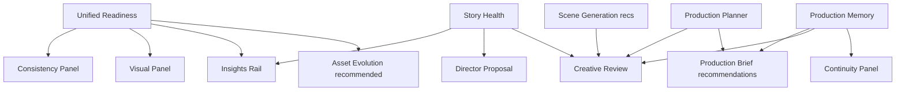

# Creation Assistant Reality Audit

> Read-only audit — geen code gewijzigd. Doel: bepalen of Studio al een Creation Assistant heeft onder andere namen.

## Welke systemen al creation guidance geven

| Systeem | Guidance | Locatie |
|---------|----------|---------|
| **Production Brief** | Recommendations, asset reasons, memory creation guidance, story preview | `studio-production-brief-flow.tsx`, `studio-production-brief-builder.ts` |
| **Production Planner** | `creationGuidance`, domain readiness, story structure phases, metrics | `studio-workspace-production-plan-panel.tsx`, `studio-production-planner.ts` |
| **Creative Review** | Strengths, weaknesses, missing, recommendations, opportunities | `studio-workspace-creative-review-panel.tsx`, `studio-creative-review.ts` |
| **Production Memory** | Similar productions, start-with suggestions, recurring patterns | `studio-production-memory-panel.tsx`, `studio-production-memory-profile.ts` |
| **AI Director / Proposal** | Readiness, story health, memory/consistency suggestions, field changes | `studio-director-proposal-flow.tsx`, `studio-director-proposal-builder.ts` |
| **Asset Evolution** | Present/recommended/missing, continuity advice, compare proposal | `studio-workspace-asset-evolution-panel.tsx`, `studio-asset-evolution.ts` |
| **Consistency panel** | Unified readiness checks, fix actions, domain scores | `studio-workspace-consistency-panel.tsx`, `studio-consistency-overview.ts` |
| **Continuity panel** | Reuse suggestions, library sections, continuity score recs | `studio-workspace-continuity-panel.tsx`, `studio-project-continuity-score.ts` |
| **Visual / Scene Generation** | Image readiness, generation steps, asset gaps, guidance key | `studio-workspace-visual-production-panel.tsx`, `studio-scene-generation-plan-summary.tsx` |
| **Production Insights rail** | Story health, readiness, fix cards, scene suggestions, quality | `studio-production-insights-rail.tsx`, `studio-production-insights.ts` |
| **Identity Builders** | Completeness score/tier per asset type | `studio-workspace-*-identity-builder.tsx` |
| **Animation / Vidu summaries** | Readiness flags, missing images → open visual | `studio-animation-plan-summary.tsx`, `studio-vidu-execution-plan-summary.tsx` |

**Conclusie:** Studio geeft overal creation guidance — maar **versnipperd over 12+ oppervlakken**, niet onder één “Creation Assistant”-naam.

---

## Welke systemen al taken genereren

| Systeem | Taak-achtig gedrag |
|---------|-------------------|
| **Production Brief** | Per-asset beslissing (use existing / build new / skip) |
| **Asset Evolution** | Generate proposal → compare → apply assets |
| **Director Proposal** | Apply modes (story / assets / audio / all); memory/consistency apply in-modal |
| **Insights rail** | Scene suggestions met Apply / Ignore |
| **Production Planner** | `creationGuidance` items = impliciete taken (“maak personage X”) |
| **Scene Generation** | Ordered `generationSteps` = beeldtaken in volgorde |
| **Readiness fixes** | Per-check fix actions met suggested asset + tool target |

**Geen centrale takenlijst.** Taken zijn impliciet in guidance-teksten, geen unified task queue.

---

## Welke systemen al quick actions bevatten

| Quick action | Waar |
|--------------|------|
| Use existing / Build new / Skip | Production Brief asset rows |
| Open library / Create new | Production Planner `creationGuidance` |
| Open related tool | Creative Review items |
| Open tab / Open | Consistency, Continuity, Visual fix cards (`StudioAiSuggestionCard`) |
| Use suggestion | Director proposal (consistency + memory) |
| Apply / Ignore | Insights rail scene suggestions |
| Generate asset proposal / Use proposal | Asset Evolution |
| Open Visual / Open Render | Animation & Vidu summaries |
| Example idea chips | Director proposal input |
| Open Continuity | Insights rail reuse block |

**Geen unified quick-action bar.** Acties zijn context-specifiek per panel.

---

## Welke systemen al ontbrekende onderdelen tonen

| Bron | Wat ontbreekt |
|------|----------------|
| Production Planner | `missingItems`, `creationGuidance` (subset) |
| Creative Review | `missingElements` (aggregated) |
| Asset Evolution | `missing` per kind |
| Scene Generation | `missingAssets`, required/recommended image counts |
| Visual panel | Asset gaps, scenes without image |
| Unified readiness | Per-check failures (characters, location, images, …) |
| Identity consumption | Completeness checks |
| Vidu execution | `missingRequirements`, warnings |

**Overlap:** dezelfde missing assets verschijnen in Planner, Evolution, Creative Review, en Readiness fixes.

---

## Welke systemen al doorverwijzen naar editors

| Navigatie | Mechanisme |
|-----------|------------|
| `onSwitchTool(toolId)` | Production, Creative Review, Consistency, Continuity, Visual, Asset Evolution, child summaries |
| Identity builder routes | Brief “Build new” → `/studio/{kind}/new` + session prefill |
| Link in Story tab | Visual panel “Edit in Story tab” |
| World identity builder | Open characters/locations/props tabs |

**Gap:** Director Proposal heeft **geen** `onSwitchTool` — suggestions apply in-modal maar springen niet naar de juiste editor-tab.

---

## Welke systemen overlappen

| Overlap | Systemen |
|---------|----------|
| Readiness score + fixes | Unified readiness → Consistency, Visual, Insights, Planner readiness |
| Missing assets | Asset evolution, Planner missingItems, Generation missingAssets, Creative Review |
| Recommendations | Planner.recommendations, Generation.recommendations, Memory, Brief — **Creative Review is de enige die ze samenvoegt in UI** |
| Reuse / memory | Continuity, Director memory suggestions, Production Memory, Brief recurring badges |
| Story structure | Planner phases, Creative Review story review, Story health advisories |
| Image gaps | Visual panel, Generation plan, Planner imagePlanning, Creative Review image review |

---

## Welke creation-assistant functionaliteit al bestaat

1. **Multi-step creation flow** — Production Brief (idea → brief → create)
2. **Advisory quality layers** — Creative Review, Consistency, Story Health
3. **Pattern-aware starts** — Production Memory creation guidance
4. **Asset decision workflow** — Brief + localStorage registry + downstream filtering
5. **Suggestion cards** — `StudioAiSuggestionCard` (Open / Use suggestion)
6. **Readiness fix pipeline** — `buildReadinessFixActions` → unified fixes
7. **Tool navigation spine** — `onSwitchTool` from workspace shell
8. **In-proposal apply** — Director memory/consistency without leaving modal
9. **Scene-level micro-assistant** — Insights rail Apply/Ignore suggestions
10. **Identity completeness** — Builders + identity consumption fix actions

**Er is geen component, tab, of API genaamd “Creation Assistant”.** Functioneel bestaat ~70% van een assistant al als **distributed creation guidance**.

---

## Welke creation-assistant functionaliteit nog ontbreekt

| Ontbreekt | Toelichting |
|-----------|-------------|
| **Unified entry point** | Geen enkele plek “wat moet ik nu doen?” |
| **Prioritized task queue** | Geen ranked next-best-action across domains |
| **Completion tracking** | Alleen asset decisions (localStorage) + ignored scene suggestions |
| **Workflow state machine** | Geen fases: brief → assets → images → audio → render |
| **Cross-tab orchestration** | Director/ Brief kunnen niet naar tool springen |
| **Single apply pipeline** | Apply werkt per systeem (proposal, scene patch, asset evolution) |
| **Production plan recommendations in UI** | Computed maar niet getoond in Production tab |
| **Generation recommendations in UI** | Computed maar niet in generation summary |
| **Fix card Apply wired** | Consistency/Visual tonen Apply soms zonder handler |
| **Post-render learning loop** | Memory leest history; geen “mark suggestion done” |
| **NL/EN assistant persona** | Geen consistente “Studio zegt…” stem over alle tabs |

---

## Welke UX-frictie nog bestaat

1. **12+ tabs/panels** — gebruiker moet weten waar guidance leeft (Production vs Creative Review vs Consistency).
2. **Dubbele lezing** — zelfde missing asset in Evolution, Planner guidance, en Creative Review.
3. **Scene vs project niveau** — Insights rail is per scene; Creative Review is project — geen brug.
4. **Pre-workspace vs workspace** — Brief flow is los; na create verdwijnt brief-context behalve decisions in localStorage.
5. **Geen “done” feedback** — domain checkmarks wel, maar geen “3 of 7 creation tasks complete”.
6. **Director modal isolation** — rijke guidance zonder jump-to-tool.
7. **Tool strip lengte** — Production, Creative Review, Consistency, Continuity, Visual overlappen conceptueel.

---

## Welke onderdelen dubbel zouden worden als we nu een Creation Assistant bouwen

| Nieuw assistant-onderdeel | Bestaande equivalent |
|---------------------------|---------------------|
| “Wat ontbreekt?” lijst | Creative Review `missingElements` + Planner `creationGuidance` |
| Quality score | Creative Review `qualitySummary` + Unified readiness |
| Story phase review | Planner story structure + Creative Review story section |
| Open tool buttons | Creative Review, Planner guidance, Consistency fixes |
| Memory-based start hints | Production Memory panel + Brief embedded block |
| Asset recommendations | Asset Evolution + Brief asset rows |
| Image todo list | Scene generation steps + Visual panel |
| Readiness checklist | Consistency panel + Production domain readiness |
| Reuse suggestions | Continuity + Director memory suggestions |
| Next steps for render | Vidu/Animation summaries + Render strategy in Consistency |

**Risico:** een nieuwe Creation Assistant die opnieuw aggregateert zonder te consolideren UI → **derde laag** naast Creative Review en Production Planner.

---

## Conclusie — classificatie

| Capability | Status |
|------------|--------|
| **Asset guidance** | **GEDEELTELIJK** — Brief, Evolution, Identity, Memory, Planner guidance; geen unified queue |
| **Story guidance** | **GEDEELTELIJK** — Story health, planner phases, Director, Creative Review; verspreid |
| **Image guidance** | **GEDEELTELIJK** — Generation steps, Visual readiness, fixes; recommendations niet in summary UI |
| **Audio guidance** | **GEDEELTELIJK** — Planner audioPlanning, Creative Review audio section, voice/music/sound tabs; geen guided flow |
| **Render guidance** | **GEDEELTELIJK** — Render strategy, Animation/Vidu summaries, Consistency embed; geen single render checklist |
| **Priority guidance** | **ONTBREEKT** — geen “doe eerst X, dan Y” across domains |
| **Quick actions** | **GEDEELTELIJK** — per panel; geen unified action bar |
| **Open editor actions** | **BESTAAT AL** — `onSwitchTool` + identity routes (behalve Director modal) |
| **Completion tracking** | **ONTBREEKT** — alleen asset decisions + ignored suggestions |
| **Production workflow guidance** | **GEDEELTELIJK** — Brief pre-flow + Planner domains; geen end-to-end workflow assistant |

### Eindoordeel

**Studio heeft geen Creation Assistant als productconcept, maar wel een de facto Creation Assistant als ecosysteem** — verspreid over Production Brief, Planner, Creative Review, Consistency, Continuity, Insights rail, Director, Memory, en fix-action pipeline.

Een nieuwe “Creation Assistant” sprint moet **consolideren en prioriteren**, niet opnieuw planners of readiness bouwen.
