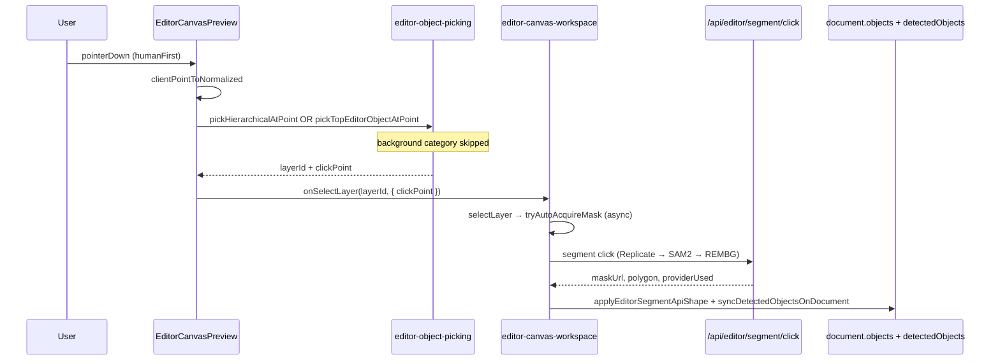

# Editor Hit Testing Reality Audit

Audit date: 2026-06-10  
Scope: **audit-only** — click-selection pipeline after Detection Bootstrap + Replicate provider integration.  
Method: code trace + reproducible simulations in `src/lib/editor-hit-testing-reality-audit.test.ts`.

**Screenshots:** not captured in this automated audit. Reproduce visually by opening Editor with Globe Man / brand sheet, enabling admin **Selection verification** panel, and comparing outline color (dashed grey = approximate, solid green = precise).  
**Trace logs:** run:

```bash
npx tsx --test src/lib/editor-hit-testing-reality-audit.test.ts 2>&1 | grep hit-test
```

---

## Executive summary

Detection bootstrap **does create selectable layers** (not only suggestion chips). Clicks on the canvas **do** call `selectLayer` → `tryAutoAcquireMask` (post–selection-fix sprint).

Selection still **feels like bbox/template selection** because:

1. Hit tests use **rectangle polygons** (`boundsToPolygon(bounds)`), reported as `polygon` method — not true contours.
2. There is **no separate “globe” layer** on brand sheets; globe clicks win the **whole “Globe Man”** region.
3. Overlapping bootstrap regions cause **wrong layer wins** (e.g. torso click → **Tekst** layer on brand sheet).
4. Part mode uses **overlapping PART_BOUNDS templates**; smallest bbox wins — “logo” click can select **face** part.
5. Replicate masks attach to **layers** after async auto-mask, but **hit tests read `detectedObjects`** which may lag until `persist()` completes; masks do not change hit priority until `object.mask` is set on synced `detectedObjects`.
6. Background is **excluded** from `pickTopEditorObjectAtPoint` in code — empty margin clicks return no layer.

---

## Pipeline trace (production code path)



| Step | File | Evidence |
|------|------|----------|
| Normalize coords | `editor-object-picking.ts` `clientPointToNormalized` | Maps client → 0–1 |
| Hierarchical pick | `editor-hierarchical-selection.ts` `pickHierarchicalAtPoint` | Part mode only after 2nd click on same mascot |
| Object pick | `editor-object-picking.ts` `pickTopEditorObjectAtPoint` | mask → polygon → bbox priority |
| Canvas handler | `editor-canvas-preview.tsx` L187–204 | Calls `onSelectLayer` with `clickPoint` |
| Auto-mask | `editor-canvas-workspace.tsx` `selectLayer` L509–511 | `tryAutoAcquireMask(layer, clickPoint)` |
| Compositor steal | `editor-compositor-overlays.tsx` L76–78 | `stopPropagation` on cutout/placement layers |

**Stale audit note:** `editor-selection-reality-audit.ts` steps 5–6 claim canvas clicks skip `selectLayer` / auto-mask — **outdated** as of selection-fix sprint. Current preview routes clicks through `selectLayer`.

---

## Verification checklist (6 questions)

### 1. Which layer wins when clicking Globe Man's globe?

| Layout | Click (norm) | Winning layer | Why |
|--------|--------------|---------------|-----|
| **Brand sheet** (bootstrap fallback) | `(0.74, 0.20)` | `brand_sheet_1_character` (“Globe Man”) | No dedicated globe layer; globe is inside character bbox |
| **Single mascot** (vision template) | `(0.50, 0.20)` | `semantic_*_globe_man` (whole mascot) | One character layer; all mascot sub-clicks hit same bbox |
| **Part mode** (2nd click on mascot) | `(0.50, 0.24)` | Root layer + part **`part_face_1`** (Face) | Smallest overlapping PART_BOUNDS wins, not globe |

**Answer:** Never a dedicated “globe-only” layer id in default bootstrap. Globe click → **Globe Man character layer** (object mode) or **face/head part** (part mode), not `globe` semantic layer.

### 2. Bootstrap regions: selectable layers or suggestion chips only?

| Artifact | Selectable? | Evidence |
|----------|-------------|----------|
| Brand sheet / vision semantic layers | **Yes** | `bootstrapEditorObjectDetection` → `objects[]` + `detectedObjects[]` |
| `EditorHumanObjectList` / layer tree | **Yes** | `onSelect` → `selectLayer` |
| `EditorClickSegmentPrompt` chips | **Separate path** | Only on **empty-canvas** click (`onEmptyCanvasClick`); not bootstrap layers |
| Transform handles on canvas | **Yes** | `data-editor-transform-handle` → `selectLayer` with click point |

Bootstrap regions are **real layers** with `metadata.bootstrapRegion: true`, `approximateSelection: true`.

### 3. Replicate masks generated but not attached to active layer?

| Stage | Attached? | Evidence |
|-------|-----------|----------|
| API returns mask | Yes | `editor-segmentation-provider.ts` persists `maskUrl` to Blob |
| Layer `selectionShape` | Yes (on success) | `applyEditorSegmentApiShape` in workspace |
| `detectedObjects[].mask` | Yes after `persist` | `applySegmentShapeToLayer` → `syncDetectedObjectsOnDocument` |
| Hit test uses mask | **Only if** `object.mask` set | `maskHitTest` checks `object.mask` / `maskStorageKey` |
| Visual outline | Yes when precise | `isApproximateEditorSelection` false → green contour |
| **Race window** | **Possible gap** | `tryAutoAcquireMask` async; user may click again before `persist`; `applySegmentShapeToLayer` uses closure `document` not always latest `nextDocument` |

**Answer:** Masks **are** attached on success, but user can still see approximate behavior during async refine or if Replicate/SAM2/REMBG all fail. Failed auto-mask leaves layer approximate.

### 4. Does `editor-object-picking.ts` return approximate bbox layers?

**Yes.** `buildEditorObjectsFromLayers` sets:

```typescript
polygon: shape?.polygon ?? boundsToPolygon(layer.bounds)
```

With no mask, `pickTopEditorObjectAtPoint` hits via `polygonHitTest` on a **rectangle** — method reported as `"polygon"`, not `"bbox"`, but geometry is still the template box.

No raster alpha test at pick time (`maskHitTest` uses polygon proxy only).

### 5. Background excluded from hit testing?

**Yes (object pick).** `isPickableEditorObject`:

```typescript
return object.category !== "background" && object.layerId !== "background";
```

Simulated click `(0.98, 0.98)` → `winningLayerId: null`.  
Background layer still exists in `objects[]` for tools; not picked on canvas.

### 6. Active layer id per target (simulated traces)

#### Brand sheet layout (`detectionMeta.source: brand_sheet`)

| User target | Click (x, y) | Winning layer id | Layer label | Hit method | Detection source | Mask | Approximate |
|-------------|--------------|------------------|-------------|------------|------------------|------|-------------|
| Globe on mascot | 0.74, 0.20 | `brand_sheet_1_character` | Globe Man | polygon | brand_sheet | none | yes |
| Logo | 0.20, 0.12 | `brand_sheet_0_logo` | Logo | polygon | brand_sheet | none | yes |
| Head on mascot | 0.72, 0.12 | `brand_sheet_1_character` | Globe Man | polygon | brand_sheet | none | yes |
| Body / torso | 0.70, 0.32 | `brand_sheet_2_text` | Tekst | polygon | brand_sheet | none | yes |
| Background margin | 0.98, 0.98 | *(none)* | — | none | — | — | — |

**Critical overlap bug (brand sheet):** torso click on mascot selects **Tekst** band because `BRAND_SHEET_REGIONS` Tekst bbox (`y: 0.28–0.42`) overlaps Globe Man lower area.

#### Single mascot layer (`BOUNDS_BY_TYPE.character` template)

| User target | Click (x, y) | Winning layer id | Hit method | Mask | Approximate |
|-------------|--------------|------------------|------------|------|-------------|
| Globe | 0.50, 0.20 | `semantic_0_globe_man` | polygon | none | yes |
| Head | 0.50, 0.18 | `semantic_0_globe_man` | polygon | none | yes |
| Logo on chest | 0.50, 0.35 | `semantic_0_globe_man` | polygon | none | yes |
| Body | 0.50, 0.55 | `semantic_0_globe_man` | polygon | none | yes |
| Background | 0.05, 0.05 | *(none)* | none | — | — |

All sub-target clicks collapse to **one layer** until part mode or Replicate mask arrives.

#### Mascot part mode (after 2nd click → `enterPartSelectionMode`)

| User target | Click (x, y) | Active layer id | Part id | Part label | Mask |
|-------------|--------------|-----------------|---------|------------|------|
| “Globe” region | 0.50, 0.24 | `semantic_0_globe_man` | `part_face_1` | Face | none |
| Head | 0.50, 0.18 | `semantic_0_globe_man` | `part_head_0` | Head | none |
| Logo | 0.50, 0.35 | `semantic_0_globe_man` | `part_face_1` | Face | none |
| Body | 0.50, 0.50 | `semantic_0_globe_man` | `part_tie_6` | Tie | none |

Part picks use **template** `PART_BOUNDS` (`editor-part-hierarchy.ts`), not vision geometry. Smallest overlapping part wins — **not** user intent.

---

## Why detection “works” but selection feels approximate

| Observation | Root cause |
|-------------|------------|
| Object list shows Globe, Logo, Text | Bootstrap / vision seeded **semantic layers** |
| Click highlights large box | Hit test + outline use **template bounds** |
| Outline is dashed grey | `approximateSelection: true`, no `selectionShape.maskUrl` |
| “Precise” after long wait | Replicate auto-mask async; then green solid outline |
| Replace still blocked | `evaluateEditorMaskGate` requires `selectionShape.maskUrl` |
| Clicking globe doesn’t select globe part | No globe layer; part templates overlap |

---

## Compositor / overlay interference

| Overlay | Pointer events | Effect |
|---------|----------------|--------|
| `EditorCompositorOverlays` cutout/placement | **Captures** (`stopPropagation`) | Clicks hit compositor layer, not `pickAtClient` |
| `EditorSelectionOutline` | `pointer-events-none` | No steal |
| Transform handles | Separate `onPointerDown` | Selects layer with click point |

---

## Active selection state after click

| State field | Set by | Value after bootstrap click |
|-------------|--------|----------------------------|
| `selectedLayerId` | `selectLayer` | Winning `layerId` from hit test |
| `hierarchicalSelection` | `selectLayer` | `mode: "object"` first click; `part` after re-click |
| `selectedPartId` | hierarchical pick | Part id in part mode only |
| `layer.selectionShape` | auto-mask success | `maskUrl`, `selectionMode: "mask"` |
| `layer.metadata.approximateSelection` | auto-mask success | `false` |
| `detectedObjects[].mask` | `syncDetectedObjectsOnDocument` | Mirrors layer mask after persist |

---

## Reproducible trace log (2026-06-10 simulation)

```
[hit-test:brand_sheet] {"target":"globe (on mascot)","point":{"x":0.74,"y":0.2},"winningLayerId":"brand_sheet_1_character","hitMethod":"polygon","layerLabel":"Globe Man","maskStatus":"none","approximate":true}
[hit-test:brand_sheet] {"target":"logo (top-left)","point":{"x":0.2,"y":0.12},"winningLayerId":"brand_sheet_0_logo","hitMethod":"polygon","layerLabel":"Logo","maskStatus":"none","approximate":true}
[hit-test:brand_sheet] {"target":"body (mascot torso)","point":{"x":0.7,"y":0.32},"winningLayerId":"brand_sheet_2_text","hitMethod":"polygon","layerLabel":"Tekst","maskStatus":"none","approximate":true}
[hit-test:mascot_object] {"target":"globe","point":{"x":0.5,"y":0.2},"winningLayerId":"semantic_0_globe_man","hitMethod":"polygon","approximate":true}
[hit-test:mascot_part] {"target":"globe region (overlaps face)","point":{"x":0.5,"y":0.24},"partId":"part_face_1","layerLabel":"Face"}
[hit-test:mascot_part] {"target":"logo (chest)","point":{"x":0.5,"y":0.35},"partId":"part_face_1","layerLabel":"Face"}
```

---

## Root cause summary (no fixes applied)

| # | Issue | Severity |
|---|-------|----------|
| 1 | Globe is not a first-class layer; clicks map to Globe Man or face part | High |
| 2 | Brand sheet region overlap (Tekst vs Globe Man) | High |
| 3 | Polygon hit = rectangular bounds, not segmentation contour | High |
| 4 | PART_BOUNDS overlap → wrong part (face vs logo vs globe) | Medium |
| 5 | Mask hit test does not sample raster alpha | Medium |
| 6 | Async auto-mask / document closure race | Low–Medium |
| 7 | Compositor layers can steal clicks | Low |

---

## Related files

| File | Role |
|------|------|
| `src/lib/editor-object-picking.ts` | Hit testing |
| `src/components/editor/editor-canvas-preview.tsx` | Click routing |
| `src/lib/editor-brand-sheet-detection.ts` | Brand sheet template regions |
| `src/lib/editor-detection-bootstrap.ts` | Layer seeding |
| `src/lib/editor-object-detection.ts` | `detectedObjects` build |
| `src/lib/editor-part-hierarchy.ts` | PART_BOUNDS templates |
| `src/lib/editor-hit-testing-reality-audit.test.ts` | Reproducible traces |

---

## Suggested manual screenshot checklist (for QA)

1. Upload Globe Man brand sheet → screenshot layer list (8 regions).
2. Click globe → screenshot dashed outline on full Globe Man bbox.
3. After Replicate configured → click globe → screenshot green contour (if auto-mask succeeds).
4. Admin **Selection verification** panel → screenshot provider + mask persisted fields.
5. Click torso → screenshot if Tekst layer selected (brand sheet overlap).

No code changes in this audit sprint.
