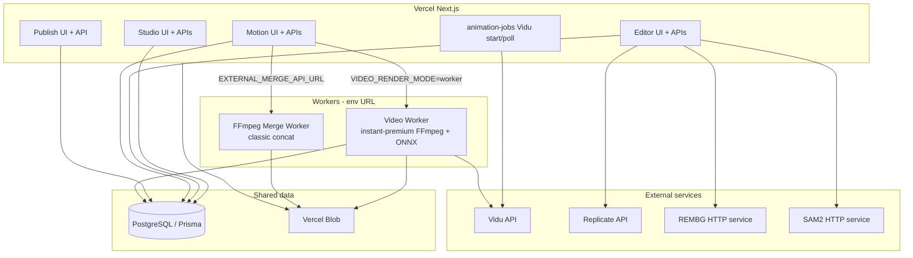

# HomeCheff Production Architecture Audit

Audit date: 2026-06-10  
Scope: **audit-only** — evidence from repository code paths, no dashboard access.  
Branch inspected: `main` (post `1cdbb82`).

---

## Executive summary

HomeCheff Studio is a **single Next.js monorepo** deployed primarily on **Vercel**. Heavy FFmpeg and ONNX workloads are **delegated to external workers** via environment variables — never hardcoded to Render URLs in `src/`.

There are **two distinct worker systems**:

1. **Instant Premium video worker** (`worker/video-worker.ts`, `Dockerfile.worker`) — FFmpeg merge, locked-text overlay, language export, RT-DETR safe zones. Env: `VIDEO_RENDER_MODE=worker`, `VIDEO_WORKER_BASE_URL`, `VIDEO_WORKER_SECRET`.
2. **Classic animation FFmpeg merge worker** (`worker/ffmpeg-merge-worker/`) — concat-only export for `projectType: "classic"`. Env: `EXTERNAL_MERGE_API_URL`, `EXTERNAL_MERGE_API_KEY`, `ANIMATION_EXPORT_MODE`.

Segmentation is **optional external HTTP** (REMBG, SAM2) plus **Replicate SAM3** (admin lab + Editor prompt fallback only).

---

## Subsystem matrix

| System | Runs On | Required? | Active? | Evidence |
|--------|---------|-----------|---------|----------|
| **Studio** | Vercel (Next.js App Router) | **Yes** | **Yes** | Routes `src/app/studio/**`; server `src/server/studio/**`; Prisma `DATABASE_URL` |
| **Editor** | Vercel (Next.js + Node API routes) | **Yes** | **Yes** | `src/app/editor/page.tsx`, `src/app/api/editor/**` |
| **Motion UI** | Vercel | **Yes** | **Yes** | `src/app/animate/**`, `src/app/videos/**`, `src/hooks/use-animation-workflow.ts` |
| **Library** | Vercel (Studio assets hub) | **Yes** | **Yes** | `src/app/studio/assets/**`, `src/lib/studio-asset-library-*.ts` |
| **Publish** | Vercel | **Optional product** | **Yes** (code live) | `src/app/publish/page.tsx`, `src/app/api/publish/export/route.ts` |
| **Asset Intelligence** | Vercel (in-process libs + Editor APIs) | **Yes** (Editor feature) | **Yes** | `src/lib/editor-asset-intelligence.ts`, wired from `editor-detection-bootstrap.ts` |
| **Replicate Integration** | Vercel → Replicate API | **No** (optional) | **Partial** | Admin: `src/app/admin/ai-lab/replicate/**`; Editor fallback: `src/app/api/editor/segment/prompt/route.ts`. **Not** in `segment-editor-layer.ts` auto-mask path |
| **Vidu Integration** | Vercel (+ worker polls when IP merge runs) | **Yes** for real Motion video | **Yes** when env set | `src/server/video-providers/vidu.ts`, `src/server/animation-jobs/service.ts`; worker imports `pollProjectJobs` in `worker-job.ts` |
| **Animation Export** | Vercel orchestrates; FFmpeg elsewhere | **Yes** (classic Motion) | **Yes** for `projectType: "classic"` | `src/server/animation-export/service.ts`, `POST /api/animations/projects/[id]/export/start` |
| **FFmpeg Merge (classic)** | External merge worker or local dev | **Yes** in prod on Vercel | **Env-dependent** | `resolveAnimationExportMode()` → `external` when `EXTERNAL_MERGE_API_URL` set in production |
| **Video Worker** | Render / Railway / Docker (not Vercel) | **Yes** for Instant Premium on Vercel | **Yes** when `VIDEO_RENDER_MODE=worker` | `worker/video-worker.ts`, `src/lib/video-worker-client.ts` |
| **Render Worker** | Render (`homecheff-motion` service) | **No** (host choice) | **Documented prod URL** | `render.yaml`, `docs/render-video-worker.md` — same codebase as Video Worker |
| **External Merge API** | Railway / Render / VPS (`ffmpeg-merge-worker`) | **Yes** if classic external export | **Env-dependent** | `src/server/animation-export/external-merge-client.ts` |
| **Railway Worker** | Railway (documented alt host) | **No** (host choice) | **Documented** | `docs/railway-video-worker.md`, `worker/ffmpeg-merge-worker/README.md` |
| **Legacy Worker** | — | **N/A** | **Not found** | No `legacy worker` string or dedicated service in repo; see Phase 4 for interpretation |
| **ONNX Detection** | Vercel (Editor) + Video worker (Motion safe zones) | **Editor: optional**; **Worker: required** for object safe zones | **Yes** | Editor: `src/app/api/editor/detect/route.ts` → `detectObjectsForEditor`. Worker: `HC_ENABLE_OBJECT_SAFE_ZONES`, `Dockerfile.worker` RT-DETR download |
| **Segmentation** | Vercel orchestrates → external HTTP / Replicate | **No** (heuristic fallback) | **Partial** | REMBG: `REMBG_API_URL`; SAM2: `SAM2_SEGMENTATION_URL`; Replicate: `REPLICATE_API_TOKEN` |

**Active?** = code paths exist and execute when env + user action trigger them. Production env values are not in git; dashboard confirmation required for live URLs.

---

## Runtime topology

---

## Per-subsystem trace

### Studio

- **UI:** `src/app/studio/page.tsx`, workspace, storyboards, characters, assets, worlds.
- **Server:** `src/server/studio/*` (storyboards, props, handoff to Motion).
- **Hosting:** Same Vercel deployment as the rest of the app (`npm run build` → `next build`).
- **No separate Studio service** in repo.

### Editor

- **UI:** `src/app/editor/page.tsx`, components under `src/components/editor/`.
- **APIs:** 15 routes under `src/app/api/editor/` (detect, segment, save, export, projects).
- **Detection bootstrap:** `src/lib/editor-detection-bootstrap.ts` — ONNX via `POST /api/editor/detect`, vision heuristics, brand-sheet fallback.
- **Runs on Vercel Node runtime** (`export const runtime = "nodejs"` on detect route).

### Motion UI

- **Instant Premium:** `src/app/animate/instant/**`, APIs `src/app/api/instant-premium/**`.
- **Classic / gallery:** `src/app/videos/**`, `src/app/animate/[id]/page.tsx`.
- **Job orchestration:** `src/server/animation-jobs/service.ts` — started from Vercel API routes (`create-and-generate`, `complete`, `jobs/start`).

### Library

- Implemented as **Studio Assets** (`src/app/studio/assets/page.tsx`, browse, subsections).
- Editor library persist: `docs/editor-library-persist-report.md`; no separate Library microservice.

### Publish

- **UI:** `src/components/publish/publish-product-page.tsx`.
- **Export:** `src/server/publish/publish-video-export-service.ts` — downloads source MP4, calls `applyLockedTextOverlay` **in the Vercel process**.
- **Constraint:** `src/lib/video-ffmpeg-runtime.ts` — `shouldRunFfmpegLocally()` is **false on Vercel**. Publish export does not check worker mode; **production Publish MP4 export likely fails** unless FFmpeg is available on the host (not documented for worker delegation).

### Asset Intelligence

- Pure TypeScript in `src/lib/editor-asset-intelligence.ts` and related `editor-asset-*` modules.
- Invoked during Editor upload/bootstrap; no external service.

### Replicate Integration

| Path | File | Production role |
|------|------|-----------------|
| Admin verification lab | `src/server/admin/replicate-sam3-seg.ts` | Manual SAM3 tests |
| Editor click-to-segment fallback | `src/server/editor/replicate-sam3-editor-segment.ts` | `POST /api/editor/segment/prompt` |
| Poster upscale gate | `src/lib/editor-poster-upscale.ts` | Checks `REPLICATE_API_TOKEN` availability only |

**Not wired:** `src/server/editor/segment-editor-layer.ts` (REMBG/heuristic only). Test asserts: `replicate-connection-verification.test.ts` — segment layer excludes replicate.

### Vidu Integration

- Provider: `src/server/video-providers/vidu.ts`.
- Config gate: `VIDU_ENABLE_REAL_CALLS=true` + `VIDU_API_KEY` (`vidu-config.ts`).
- **Starts on Vercel:** `startProjectJobs` from instant-premium and classic job APIs.
- **Also polled on video worker** during `runInstantPremiumWorkerProcess` (`worker-job.ts` lines 84–85).

### Animation Export (classic)

- Entry: `startProjectExport` in `service.ts` — **blocks** non-classic projects (`assertClassicProjectType`).
- Modes: `local` (spawn FFmpeg in Next.js process) or `external` (HTTP to merge worker).
- Default in production: **external** if `EXTERNAL_MERGE_API_URL` is set (`export-config.ts`).

### Instant Premium export (not in sprint table but coupled)

- Uses **video worker**, not external merge worker.
- `wait-for-final-export.ts`: if `isVideoRenderWorkerMode()`, dispatches `triggerWorkerInstantPremiumProcess` then polls DB.
- Worker runs `executeInstantPremiumMerge` (`merge-instant-project.ts`) with local FFmpeg on worker host.

### Video Worker vs Render Worker

- **Same process:** `npm run worker` → `worker/video-worker.ts`.
- **Endpoints:** `GET /health`, `/health/video`, `/health/vision`; `POST /jobs/instant-premium/:id/process`, `/retry-overlay`, `/jobs/language-export/:id/render`.
- **Render:** `render.yaml` names service `homecheff-motion`; docs cite `https://homecheff-motion.onrender.com`.
- **No hardcoded Render URL in `src/`** — only `VIDEO_WORKER_BASE_URL` env.

### ONNX Detection

| Consumer | Host | Trigger |
|----------|------|---------|
| Editor object list | Vercel | `POST /api/editor/detect` → `detectEditorObjectsFromImageUrl` |
| Motion safe zones / overlay placement | Video worker | `HC_ENABLE_OBJECT_SAFE_ZONES=1`, RT-DETR in `Dockerfile.worker` |
| Admin diagnostics | Vercel proxies worker | `GET /api/admin/video/vision-health?probe=1` → `fetchWorkerVisionHealth` |

### Segmentation

| Capability | Provider | Env | Route / module |
|------------|----------|-----|----------------|
| Auto-mask / refine / bg remove | REMBG | `REMBG_API_URL` | `segment-editor-layer.ts`, `POST /api/editor/segment` |
| Click precise select | SAM2 | `SAM2_SEGMENTATION_URL` | `sam2-click-segment.ts`, `POST /api/editor/segment/click` |
| Text prompt select | Replicate SAM3 | `REPLICATE_API_TOKEN` | `POST /api/editor/segment/prompt` |
| Instant Premium poster motion | REMBG or heuristic | `REMBG_API_URL` | `foreground-segmentation/segment-foreground.ts` |
| Fallback | Heuristic polygons | — | `premium-foreground-segmentation.ts`, `editor-segmentation-strategy.ts` |

---

## Deployment artifacts in repo

| Artifact | Purpose |
|----------|---------|
| `package.json` `build` | Vercel Next.js build |
| `package.json` `build:worker` | Render/Railway worker image build (downloads RT-DETR + `next build`) |
| `Dockerfile.worker` | Video worker container |
| `render.yaml` (root) | Render Blueprint for `homecheff-motion` |
| `worker/ffmpeg-merge-worker/` | Separate merge microservice |
| `rembg-service/` | Separate REMBG microservice (`render.yaml`, `railway.toml`, `fly.toml`) |

**No `vercel.json`** — Vercel behavior is platform-default Git integration.

---

## Key env gates (production)

| Variable | Effect |
|----------|--------|
| `VIDEO_RENDER_MODE=worker` | Vercel skips local FFmpeg; delegates Instant Premium merge to `VIDEO_WORKER_BASE_URL` |
| `EXTERNAL_MERGE_API_URL` | Production classic export uses external merge (auto-detect) |
| `ANIMATION_PROVIDER=vidu` + `VIDU_ENABLE_REAL_CALLS=true` | Real Vidu HTTP |
| `REMBG_API_URL` | Editor + IP foreground matting |
| `SAM2_SEGMENTATION_URL` | Editor SAM2 click segment |
| `REPLICATE_API_TOKEN` | Admin lab + Editor prompt segment only |

---

## Open questions (require dashboard / env, not code)

1. Current production values of `VIDEO_WORKER_BASE_URL` and `EXTERNAL_MERGE_API_URL` (Render vs Railway vs other).
2. Whether Render auto-deploy is enabled on every `main` push (see `deployment-trigger-audit.md`).
3. Whether Publish export is used in production given Vercel FFmpeg constraints.

---

## Related docs

- `docs/render-dependency-audit.md`
- `docs/deployment-trigger-audit.md`
- `docs/worker-reality-audit.md`
- `docs/infrastructure-cost-audit.md`
- `docs/segmentation-platform-audit.md`
- `docs/infrastructure-cleanup-plan.md`
