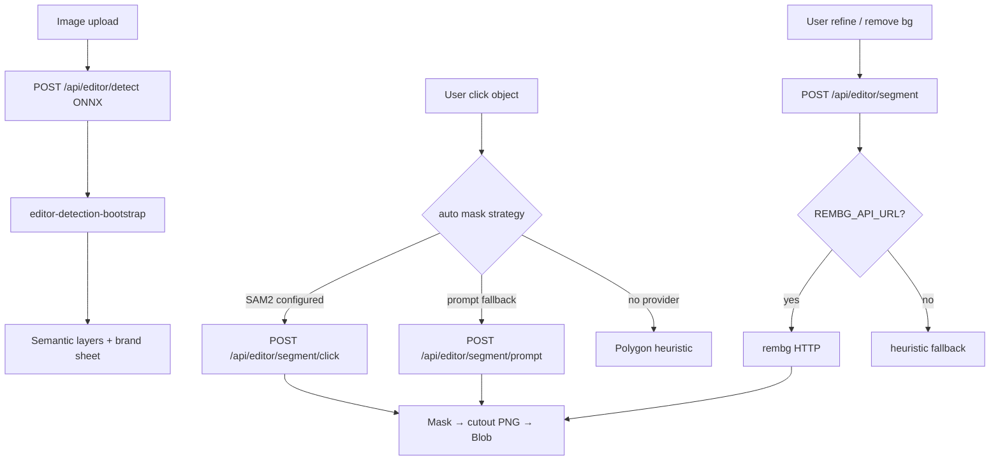

# Segmentation Platform Audit

Audit date: 2026-06-10  
Scope: production paths for Object Selection, Background Removal, Logo Selection, Mascot Editing, Cutouts — compare SAM2, REMBG, Replicate SAM3, Grounded SAM, Lang Segment Anything.

**Method:** trace `src/server/editor/*`, `src/lib/editor-*`, `src/app/api/editor/segment/*`, Instant Premium foreground segmentation.

---

## Capability → production path

| Capability | Primary path today | Provider | Env gate | API / module |
|------------|-------------------|----------|----------|--------------|
| **Object selection (upload)** | ONNX + vision bootstrap | RT-DETR / heuristics | Models on Vercel for Editor detect | `POST /api/editor/detect`, `editor-detection-bootstrap.ts` |
| **Object selection (click)** | SAM2 click segment | SAM2 HTTP | `SAM2_SEGMENTATION_URL` | `POST /api/editor/segment/click`, `sam2-click-segment.ts` |
| **Object selection (text prompt)** | Replicate SAM3 fallback | Replicate | `REPLICATE_API_TOKEN` | `POST /api/editor/segment/prompt` |
| **Background removal** | REMBG matting | REMBG HTTP | `REMBG_API_URL` | `segment-editor-layer.ts` mode `remove_background` |
| **Logo selection** | Brand-sheet heuristics + ONNX labels | In-process | — | `editor-brand-sheet-detection.ts`, detect bootstrap |
| **Mascot editing** | Polygon mask + cutout from segment | REMBG/heuristic/SAM2 | REMBG or SAM2 | `editor-object-mask.ts`, segment routes |
| **Cutouts** | Mask → sharp cutout PNG → Blob | REMBG/SAM2/Replicate | Per provider | `segment-editor-layer.ts`, `sam2-click-segment.ts`, `replicate-sam3-editor-segment.ts` |

Status API: `GET /api/editor/segment/status` — exposes `rembgAvailable`, `sam2Available`, `replicateConfigured`, `autoMaskStrategy`.

---

## Provider inventory

### Current — SAM2

| Field | Detail |
|-------|--------|
| **In repo deployable?** | **No** — only client `SAM2_SEGMENTATION_URL` |
| **Wired routes** | `POST /api/editor/segment/click` |
| **Auto-mask default** | **No** — `editor-segmentation-strategy.ts` notes "not wired to editor yet" for full auto path; `tryAutoAcquireMask` uses SAM2 when configured |
| **Instant Premium** | Listed in `SegmentationProvider` type but IP foreground uses rembg/heuristic (`segment-foreground.ts`) — **not SAM2** |
| **Production ready flag** | `envSet("SAM2_SEGMENTATION_URL")` |

### Current — REMBG

| Field | Detail |
|-------|--------|
| **In repo deployable?** | **Yes** — `rembg-service/` (Docker, Render/Railway/Fly blueprints) |
| **Wired routes** | `POST /api/editor/segment` (refine), background remove |
| **Instant Premium** | `tryRembgApi` in `segment-foreground.ts` for poster motion layers |
| **Contract** | POST JPEG body → PNG mask (`rembg-service-contract.test.ts`) |
| **Production ready** | `segmentationProviderAvailable("rembg")` |

### New — Replicate SAM3 (`yodagg/sam3-image-seg`)

| Field | Detail |
|-------|--------|
| **Model ID** | `REPLICATE_SAM3_MODEL_ID` in `replicate-client.ts` |
| **Wired routes** | Admin `POST /api/admin/ai-lab/replicate/run`; Editor `POST /api/editor/segment/prompt` |
| **NOT wired** | `segment-editor-layer.ts` (test: `!segmentLayer.includes("replicate")`) |
| **Cost estimate in code** | ~$0.01/prediction |
| **Supports text prompt** | **Yes** — primary differentiator vs REMBG full-image matting |

### New — Grounded SAM / Lang Segment Anything

| Field | Detail |
|-------|--------|
| **In codebase** | **Not found** — no imports, env vars, or API routes |
| **Status** | **Planning / external only** — would require new integration similar to `replicate-sam3-editor-segment.ts` |

---

## Provider comparison matrix

| Criterion | SAM2 (external) | REMBG (self-host) | Replicate SAM3 |
|-----------|-----------------|-------------------|----------------|
| **Click/point segment** | **Yes** (primary) | No (full image) | **Yes** (prompt-based) |
| **Full-image foreground** | No | **Yes** | Partial (prompt-dependent) |
| **Background remove** | Via mask | **Yes** (native) | Via mask output |
| **Logo / text bands** | No | No (uses heuristics separately) | Prompt possible |
| **Mascot cutout** | **Yes** | **Yes** (bbox from alpha) | **Yes** |
| **Deploy in monorepo** | No | **Yes** | N/A (SaaS) |
| **Vercel-compatible** | **Yes** (HTTP out) | **Yes** | **Yes** |
| **Per-call cost** | Host GPU | ~fixed $7–15/mo | ~$0.01/run |
| **Production wired** | Click only | Refine + bg remove + IP | Prompt + admin lab |

---

## Can Replicate replace SAM2?

| Aspect | Verdict | Evidence |
|--------|---------|----------|
| **Click/point selection** | **Partial** — Replicate path uses **text prompt** (`segment/prompt`), not true point-click SAM2 API | `segment/prompt/route.ts` default prompt `"person"` |
| **Precise Select UI** | **Not equivalent** without UI + API changes to pass click coordinates to a point-prompt model | SAM2 contract in `sam2-click-segment.ts` sends point/box |
| **Drop-in replacement** | **No today** — different routes and request shapes | |
| **Future replacement** | **Yes** if SAM3 (or Grounded SAM on Replicate) accepts point/box inputs and Editor routes are unified | |

**Conclusion:** Replicate SAM3 can replace SAM2 **only after integration work** — not a config-only swap.

---

## Can Replicate replace REMBG?

| Aspect | Verdict | Evidence |
|--------|---------|----------|
| **Full-image background removal** | **Partial** — SAM3 is prompt-segmentation; REMBG is class-agnostic matting | REMBG returns alpha without prompt |
| **Editor refine/auto-mask** | **Possible** with prompt tuning per object | Would need changes to `segment-editor-layer.ts` |
| **Instant Premium foreground** | **Possible** — replace `tryRembgApi` | `segment-foreground.ts` |
| **Cost at scale** | Replicate per-call may exceed flat REMBG host for high volume | See cost audit |
| **Drop-in today** | **No** — REMBG is hardcoded in `segment-editor-layer.ts` and `segment-foreground.ts` | |

**Conclusion:** Replicate **can** replace REMBG functionally for many cutout tasks **with code changes**; not wired today.

---

## Can Replicate replace both?

| Question | Answer |
|----------|--------|
| **Technically** | **Yes, in principle** — one HTTP API from Vercel, text/point prompts, mask output compatible with existing `editor-object-mask.ts` pipeline |
| **With current code** | **No** — only `/segment/prompt` + admin lab |
| **Recommended sequence** | 1) Replace REMBG in `segment-editor-layer.ts` + IP foreground. 2) Unify click + prompt under Replicate or add Grounded SAM. 3) Deprecate `SAM2_SEGMENTATION_URL`. |

---

## Segmentation flow (Editor)

---

## Instant Premium segmentation (separate from Editor)

- Module: `src/server/instant-premium/foreground-segmentation/segment-foreground.ts`
- Providers: `heuristic` | `rembg` | `sam2` | `manual` in `premium-foreground-segmentation.ts`
- **Runtime:** `resolveSegmentationProvider` — SAM2/rembg only if env set; else heuristic
- **Runs on:** Vercel (calls REMBG URL) — not on video worker

---

## Production recommendation (audit-only)

| Priority | Action |
|----------|--------|
| **P0** | Confirm which env vars are set in production (`REMBG_API_URL`, `SAM2_SEGMENTATION_URL`, `REPLICATE_API_TOKEN`) |
| **P1** | If consolidating on Replicate: wire `segment-editor-layer.ts` before paying for REMBG host |
| **P2** | Evaluate Grounded SAM on Replicate for logo/mascot prompts vs custom SAM2 GPU |
| **P3** | Keep heuristic + ONNX bootstrap — no external cost |

---

## Related docs

- `docs/rembg-deployment.md`
- `docs/replicate-connection-verification-report.md`
- `docs/editor-selection-reality-report.md`
- `infrastructure-cleanup-plan.md`
