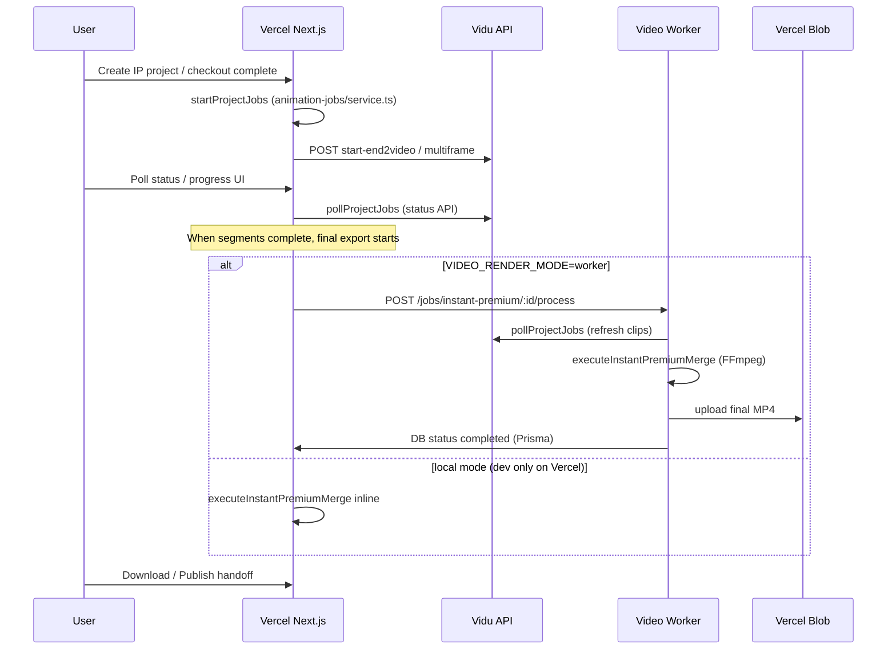
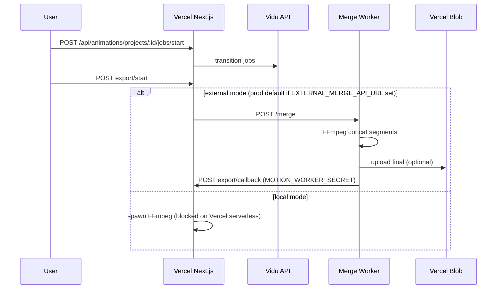
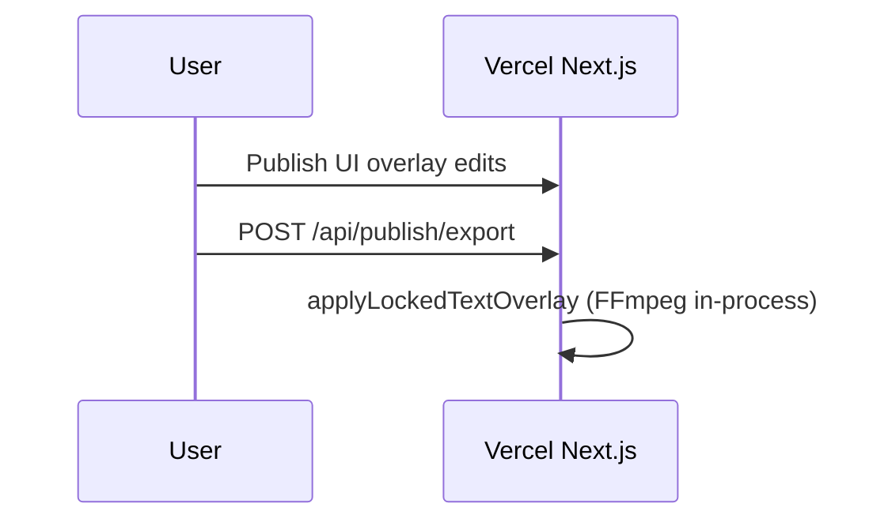

# Worker Reality Audit

Audit date: 2026-06-10  
Scope: trace Motion → render → export → merge → publish; determine which workers are required, optional, or dead.

---

## Motion pipeline overview

HomeCheff has **two Motion project types** with **different export paths**:

| `projectType` | Primary UI | Vidu jobs | Final merge |
|---------------|------------|-----------|-------------|
| `instant_premium` | `/animate/instant/**` | Vercel starts; worker may poll | **Video worker** (`VIDEO_RENDER_MODE=worker`) |
| `classic` (default) | `/videos/[id]`, `/animate/[id]` | Vercel | **External merge worker** OR local FFmpeg |

Evidence: `assertClassicProjectType` in `animation-export/service.ts`; `isInstantLikeProject` in `instant-project-utils.ts`.

---

## End-to-end trace

### A. Instant Premium (primary production path)



**Key files:**

| Step | Module |
|------|--------|
| Start Vidu | `src/server/animation-jobs/service.ts` ← `src/app/api/instant-premium/create-and-generate/route.ts` |
| Dispatch merge | `src/server/instant-premium/wait-for-final-export.ts` |
| Worker job | `src/server/instant-premium/worker-job.ts` → `merge-instant-project.ts` |
| Worker HTTP | `worker/video-worker.ts` |

**Does NOT use** `EXTERNAL_MERGE_API_URL` or `ffmpeg-merge-worker` for Instant Premium.

---

### B. Classic Motion export



**Key files:**

| Step | Module |
|------|--------|
| Export start | `src/app/api/animations/projects/[id]/export/start/route.ts` |
| Mode resolution | `src/server/animation-export/export-config.ts` |
| External client | `src/server/animation-export/external-merge-client.ts` |
| Merge worker | `worker/ffmpeg-merge-worker/src/server.ts` |

---

### C. Publish (post-Motion)



**No worker delegation** in `publish-video-export-service.ts`. On Vercel, `shouldRunFfmpegLocally()` is false — **Publish export is not wired to video worker**.

Evidence: `src/lib/video-ffmpeg-runtime.ts` lines 8–15; `publish-video-export-service.ts` calls `applyLockedTextOverlay` directly.

---

### D. Language export (Instant Premium adjunct)

- `src/server/instant-premium/language-export-service.ts`
- If not local FFmpeg: `triggerWorkerLanguageExport` → video worker `POST /jobs/language-export/:id/render`
- **Same video worker** as Instant Premium merge — not merge worker.

---

## Worker classification

| Worker | Required | Optional | Dead | Evidence |
|--------|----------|----------|------|----------|
| **Video worker** (`worker/video-worker.ts`) | **Yes** for Instant Premium + language export on Vercel when `VIDEO_RENDER_MODE=worker` | Alternative: `VIDEO_RENDER_MODE=local` on non-Vercel host with FFmpeg | **No** | `wait-for-final-export.ts`, `language-export-service.ts`, `worker-job.ts` |
| **Render-hosted video worker** (`homecheff-motion`) | **No** (hosting choice) | **Yes** — one of Render/Railway/Docker | **No** if env points here | `render.yaml`, docs only; runtime uses `VIDEO_WORKER_BASE_URL` |
| **Railway video worker** | **No** (hosting choice) | **Yes** — substitute for Render | **No** if env points here | `docs/railway-video-worker.md` |
| **External merge worker** (`ffmpeg-merge-worker`) | **Yes** for classic Motion export on Vercel when `EXTERNAL_MERGE_API_URL` set | **Skippable** if all projects are `instant_premium` and classic export unused | **Not dead** — code active for `projectType: classic` | `startProjectExport`, `assertClassicProjectType` |
| **Legacy worker** (named in sprint) | — | — | **Dead / undefined** | No service, env, or route named "legacy worker" in repo. Interpret as: (1) deprecated Render native Node deploy path vs Docker, or (2) classic merge path superseded by IP video worker for new traffic |
| **REMBG service** (`rembg-service/`) | **No** | **Yes** — heuristic fallback | **No** | `REMBG_API_URL` optional; `segment-editor-layer.ts` |
| **SAM2 service** (external) | **No** | **Yes** — click segment only | **N/A in repo** | No deployable SAM2 in monorepo; env URL only |

---

## Does current Motion generation still require…?

### Render worker?

| Question | Answer |
|----------|--------|
| Is Render **required**? | **No** — any host satisfying video worker contract works |
| Is **a video worker** required on Vercel? | **Yes** when `VIDEO_RENDER_MODE=worker` (documented production setup) |
| Does worker run Vidu generation? | **No** — Vidu **starts** on Vercel; worker **polls** and **merges** |
| Does worker run segmentation? | **No** — REMBG/Replicate called from Vercel Editor/IP paths |

### Railway worker?

| Role | Required? |
|------|-----------|
| Video worker on Railway | **Optional** alternative to Render — same `Dockerfile.worker` |
| Merge worker on Railway | **Required for classic export** only if `EXTERNAL_MERGE_API_URL` points to Railway merge service |

### External merge worker?

| Traffic | Required? |
|---------|-----------|
| Classic `/videos/[id]` final export in production | **Yes** (Vercel cannot run local merge reliably) |
| Instant Premium | **No** — uses video worker internal FFmpeg |
| Studio handoff / new Instant wizard | **Likely no** — creates `instant_premium` projects |

---

## Worker responsibilities split

| Capability | Video worker | Merge worker | Vercel app |
|------------|--------------|--------------|------------|
| Start Vidu jobs | — | — | **Yes** |
| Poll Vidu | **Yes** (during worker job) | — | **Yes** |
| Concat segment MP4s | **Yes** (IP) | **Yes** (classic) | Local dev only |
| Locked text overlay (drawtext) | **Yes** (IP) | — | Publish attempts inline |
| Poster motion compositor | **Yes** (IP) | — | — |
| RT-DETR object safe zones | **Yes** | — | Editor ONNX only |
| Language export FFmpeg | **Yes** | — | — |
| REMBG / SAM2 / Replicate | — | — | **Yes** |

---

## Env decision tree (production on Vercel)

```
VIDEO_RENDER_MODE=worker  →  VIDEO_WORKER_BASE_URL + VIDEO_WORKER_SECRET  →  Video worker REQUIRED

Classic export:
  EXTERNAL_MERGE_API_URL set (prod)  →  Merge worker REQUIRED
  unset  →  local merge (fails on Vercel serverless)

REMBG_API_URL set  →  REMBG host REQUIRED for matting (any provider)
SAM2_SEGMENTATION_URL set  →  External SAM2 REQUIRED for click segment
REPLICATE_API_TOKEN set  →  Replicate API (no worker)
```

---

## Instant Premium worker job internals

From `worker-job.ts` (`runInstantPremiumWorkerProcess`):

1. Load project; skip if already completed.
2. `refreshTransitionOutputsFromProvider` + `pollProjectJobs` — **worker-side Vidu poll**.
3. If transitions incomplete → return `waiting_clips`.
4. `executeInstantPremiumMerge` — full FFmpeg pipeline on worker.
5. Update Prisma status; Vercel poller reads DB.

Retry overlay: `POST /jobs/instant-premium/:id/retry-overlay` → `executeInstantPremiumMerge({ force: true })`.

---

## Conclusions

1. **Motion generation (Vidu)** runs from **Vercel**; workers do not replace Vidu.
2. **Instant Premium final delivery** requires the **video worker** on Vercel production (worker mode).
3. **Classic Motion export** requires the **external merge worker** when external mode is active — separate codebase path from video worker.
4. **Render** is one hosting option for the video worker; not architecturally mandatory.
5. **Legacy worker** has no codebase identity — treat as documentation/deploy drift (native Node vs Docker Render).
6. **Publish** is not integrated with any worker — gap for production FFmpeg on Vercel.

---

## Related docs

- `homecheff-production-architecture-audit.md`
- `render-dependency-audit.md`
- `infrastructure-cleanup-plan.md`
